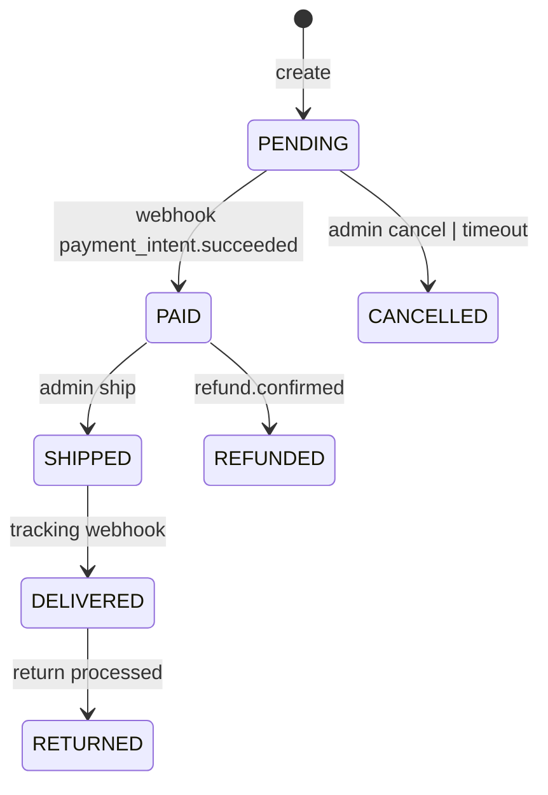

# Audit transversal

Les pires bugs Synclune ne sont pas dans un module mais **aux frontières**. Ce prompt couvre les invariants qui traversent plusieurs modules.

> **À lancer après** au moins 50% des audits modulaires de [`02-modules.md`](./02-modules.md), pour avoir matière à corréler.

---

**TLDR** : cohérence inter-modules — cache tags, state machines, error handling, naming, auth helpers.
**Criticité** : 🔴 critique systémique
**Effort estimé** : ⏱ 4-6h
**Prérequis** : `00-standards.md`, `01-conventions.md`, idéalement la moitié de `02-modules.md`
**Tests à lancer** : `pnpm typecheck && pnpm lint && pnpm test:critical`

## Prompt

```
Audit transversal Synclune — invariants inter-modules.

# 1. Matrice des cache tags
Pour chaque mutation d'un module, lister les tags qu'elle invalide. Vérifier que les modules CONSOMMATEURS de ces tags lisent bien la version invalidée.

Exemple à valider :
- payments/webhooks/charge.refunded → updateTag("orders-list") + updateTag("order-${id}") + updateTag("refunds-list") + updateTag("refund-${id}").
  Modules consommateurs : orders/data (✓), refunds/data (✓), dashboard/data (?), emails (?).

Construire une matrice tags × modules (rows: tags, cols: modules) avec ✓ producer / 👁 consumer / ✗ missing.
Tout ✗ = P0/P1 selon impact (stale data utilisateur P0, stale data admin P1).

# 2. State machines globales
Construire le diagramme combiné OrderStatus × PaymentStatus × FulfillmentStatus × RefundStatus :
- Quelles combinaisons sont VALIDES ?
- Quelles transitions sont autorisées ?
- Existe-t-il du code qui force des transitions invalides (ex. refund avant payment success) ?

Vérifier que :
- modules/orders/services/order-status-validation.service.ts existe et est pure (P1 si manquant).
- modules/refunds/services/ : pas de state machine pure dédiée à ce jour. Vérifier la cohérence transition refund via `refund-calculation.service.ts` + `return-eligibility.service.ts` + handlers webhook (`charge.refund.updated`, `refund.failed`). P1 si refund.status change sans validation.
- payments/webhooks vérifient `canTransition` AVANT update (P0 si transition arbitraire).

# 3. Naming inter-modules
Auditer la cohérence des conventions :
- Reads cachés : `getX` (public) + `_fetchX` (interne) — partout ?
- Mutations : verbe simple `createX` / `updateX` / `deleteX` / `bulkX` — partout ?
- Services purs : `buildX` / `computeX` / `validateX` / `formatX` — partout ?
- Hooks : `useX` strict + return signature stable (tuple OU object cohérent) ?

Lister toutes les exceptions et les classer P1 (refactor naming) ou P2 (préférence).

# 4. Error handling uniformity
Tous les Server Actions doivent :
- Commencer par `requireAuth()` ou `requireAdmin()` (sinon P0 sécurité).
- Valider via `validateInput(schema, data)` (P1 si pas).
- Catcher via `handleActionError(e, msg)` (P1 si pas — risque erreur non sanitized).
- Retourner via `success() / error() / ...` typés (pas string brut).
- Appeler `updateTag(...)` avant return success.

Grep `"use server"` puis vérifier chaque fichier matche le pattern. Noter les déviations.

# 5. Auth helpers usage
- 100% des Server Actions admin commencent par `requireAdmin()` ou `requireAdminWithUser()` (P0 si manque) ?
- 100% des Server Actions user commencent par `requireAuth()` ?
- 0 manipulation de session brute (`auth()` direct sans helper) hors `modules/auth/lib/` ?

Grep `auth\(\)` (Better Auth direct) hors auth/lib/ → P1 (devrait passer par helper).
Grep `"use server"` puis fichier → vérifier première ligne fonction protégée.

# 6. updateTag exhaustivité
Pour chaque mutation, l'invalidation cache doit couvrir :
- Liste(s) impactée(s) (ex. `products-list`, `products-list-${collectionSlug}`)
- Détail(s) impacté(s) (ex. `product-${slug}`)
- Sitemap si applicable (ex. `sitemap-products`)
- Modules dépendants (ex. update product → invalide aussi reviews-${productId} si rating change)

Audit chaque fichier `actions/*.ts`, lister les `updateTag` appelés, comparer aux tags réellement nécessaires.

# 7. Type duplication
Grep tous les `interface` / `type` qui ressemblent à un schema Zod :
- Si schema existe, doit être `type X = z.infer<typeof xSchema>`.
- Si type est manuel et schema parallèle, P1 (drift risque).

Lister les paires détectées.

# 8. Exception services/ documentées
Vérifier que CHAQUE fichier `modules/<X>/services/*.ts` qui fait de l'I/O (prisma, fetch, email) :
- Apparaît dans `01-conventions.md` § "Services transactionnels partagés" (acceptable),
- OU est un cas P1 layering violé.

Lister les services I/O non documentés.

# 9. Reads de validation dans actions/
Les `findUnique` / `findFirst` / `findMany` dans `actions/*.ts` doivent être :
- Vérifications d'existence avant mutation (acceptable),
- Vérifications d'unicité (acceptable),
- Récupération pour bulk (acceptable),
- OU à déplacer en data/ (P2 si pas critique).

Lister les reads non transactionnels et juger.

# 10. Composition des layouts (app/)
- Boundaries `"use client"` minimales (descendre le plus bas dans l'arbre).
- Wrappers RSC en haut pour streamer le data.
- Suspense parallèles plutôt que Promise.all dans pages.
- Loading.tsx miroir layout (CLS 0).

Audit niveau app/, pas modules/. Référence prompt `04-foundations.md` (app section) pour détail.

# 11. Couverture tests par module
Pour chaque module, lister :
- Couverture lines % (Vitest --coverage).
- Couverture branches % (idem).
- Tests E2E associés (Playwright).
- Tests critical path présents si applicable.

Critères P1 : couverture < 70% lines sur module critical path. Couverture < 50% lines sur module standard.

# 12. Tooling globalement
- knip / ts-prune : exports morts à supprimer.
- madge : circular deps.
- depcheck : dépendances inutilisées / manquantes.

Si les outils ne sont pas installés, proposer en P2 (DX).

# 13. Migrations Prisma cohérence
- Toute nouvelle migration testée rollback ?
- Indexes ajoutés cohérents avec query patterns ?
- Pas de DROP destructif sans plan multi-step ?

# 14. Memory feedbacks owner
Vérifier que tous les feedbacks listés dans `01-conventions.md § Memory feedbacks` sont respectés. Tout violation = P1 (régression).

# Livrable transversal
Rapport structuré avec :
1. Matrice cache tags × modules (markdown table).
2. Diagramme state machines globales (mermaid acceptable).
3. Liste P0 (privilege escalation, transition invalide, signature webhook bypass...).
4. Liste P1 (naming inconsistant, type duplication, layering violé documenté).
5. Liste P2 (tooling manquant, polish).
6. Plan d'application : par ordre d'impact + risques.
7. Note systémique sur 10 (cohérence / robustesse / dette systémique).
```

## Definition of done

- [ ] Matrice cache tags livrée (tableau markdown).
- [ ] Diagramme state machines livré (mermaid ou ASCII).
- [ ] 100% Server Actions vérifiées contre pattern (auth + validate + catch + updateTag).
- [ ] 0 violation auth helpers détectée non documentée.
- [ ] Tooling proposé (knip/madge) si absent.
- [ ] `pnpm typecheck && pnpm lint && pnpm test:critical` verts.

## Outputs attendus (templates)

### Matrice cache tags

```md
| Tag                     | Producer modules      | Consumer modules              | Status  |
| ----------------------- | --------------------- | ----------------------------- | ------- |
| `products-list`         | products, collections | products/data, dashboard/data | ✓       |
| `products-list-${slug}` | products              | collections/data              | ⚠ check |
| `cart-${userId}`        | cart                  | cart/data, orders/checkout    | ✓       |
| ...                     | ...                   | ...                           | ...     |
```

### Diagramme state machine (exemple mermaid)



### Tableau Server Actions audit

```md
| Fichier                                           | requireX | validate | handleError | updateTag                  | Status |
| ------------------------------------------------- | -------- | -------- | ----------- | -------------------------- | ------ |
| modules/orders/actions/cancel-order.ts            | ✓ Admin  | ✓        | ✓           | ✓ orders-list, order-${id} | OK     |
| modules/products/actions/bulk-archive-products.ts | ✓ Admin  | ✓        | ✓           | ⚠ manque sitemap           | P1     |
| ...                                               | ...      | ...      | ...         | ...                        | ...    |
```

## Anti-fragilité

Cet audit est censé être **rejouable** — chaque trimestre idéalement. Documenter les findings résolus dans un journal `docs/audit/cross-module-history.md` (à créer si besoin) pour traquer la dette systémique au fil du temps.
